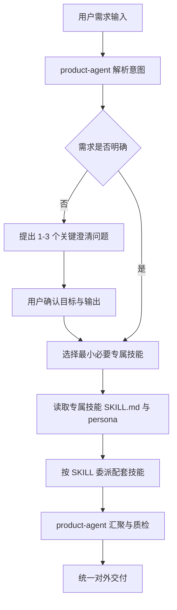

# 产品管理智能体团队：**product-agent** + 专属技能 委派

基于单 **Agent** 架构：`**[product-agent/](product-agent/)`** 为唯一对外入口；业务流程先进入 6 个专属技能之一，再由专属技能 `SKILL.md` 委派配套技能，形成「需求输入 → 分析 → 管理 → 方案 → 评审」闭环。

## 快速开始
不同渠道请选择不同的配置流程，先阅读配置流程，将流程中的提示词发送给你的智能体，完成配置～

| 配置渠道            | 文档路径                                   |
| ----------------- | ----------------------------------------- |
| Qclaw/OpenClaw    | `[README_Qclaw.md](README_Qclaw.md)`      |
| Hermes Agent      | `[README_Hermes.md](README_Hermes.md)`    |

## 1. 架构目标

- **单入口**：由 **product-agent** 接收编排并统一交付口径。
- **专属技能白名单**：仅 6 个目录 `name` 可作为业务编排第一站。
- **配套技能**：仅由专属技能文档内相对路径委派，不作为用户意图第一跳。
- **可追溯产物**：约定写入 `shared/` 等目录，避免资料散落。

## 2. 协作原则

- 先澄清六项（目标 / 阶段 / 输入 / 输出 / 验收 / 专属技能），再加载技能。
- 最小必要专属技能：单个专属技能可闭环则不串联多个专属技能。
- 需求不明确时不加载技能。

### 2.1 调度流程

### 2.2 典型路由（按专属技能）

| 场景               | 专属技能（第一站）                                                                                                                           |
| ---------------- | ----------------------------------------------------------------------------------------------------------------------------------- |
| 仅竞品分析            | `product-exploration`                                                                                                               |
| 仅 PRD 评审         | `requirement-review`（必要时再接 logic-detector / issue-tracker）                                                                          |
| 飞书需求运维           | `requirement-management`                                                                                                            |
| 用户舆情与指标          | `user-analysis`                                                                                                                     |
| PRD + 图 + 原型     | `solution-design`                                                                                                                   |
| 访谈提炼             | `customer-research`                                                                                                                 |
| 单个专属技能示例         | `product-exploration` / `requirement-review` / `user-analysis` / `requirement-management` / `solution-design` / `customer-research` |
| 串联示例 1（用户反馈驱动迭代） | `user-analysis` → `requirement-management` → `solution-design` → `requirement-review`                                               |
| 串联示例 2（客研到评审闭环）  | `customer-research` → `requirement-management` → `requirement-review`                                                               |
| 串联示例 3（竞品驱动方案输出） | `product-exploration` → `solution-design` → `requirement-review`                                                                    |

## 3. product-agent 人设（源文件）

仓库源路径：

- `[product-agent/AGENTS.md](product-agent/AGENTS.md)`
- `[product-agent/IDENTITY.md](product-agent/IDENTITY.md)`
- `[product-agent/SOUL.md](product-agent/SOUL.md)`

通过 Qclaw 写入该智能体 workspace 根目录下同名文件。

## 4. 专属技能与目录说明

| 专属技能                     | 中文名称 | 技能目录                                                               | 说明                                     |
| ------------------------ | ---- | ------------------------------------------------------------------ | -------------------------------------- |
| `customer-research`      | 客研沟通 | `[skills/customer-research/](skills/customer-research/)`           | 客研：访谈、痛点、候选需求                          |
| `product-exploration`    | 产品探索 | `[skills/product-exploration/](skills/product-exploration/)`       | 竞品探索：抓取 / 报告 / 差异面板                    |
| `user-analysis`          | 用户分析 | `[skills/user-analysis/](skills/user-analysis/)`                   | 舆情、指标、反馈、预警、看板                         |
| `requirement-management` | 需求管理 | `[skills/requirement-management/](skills/requirement-management/)` | 飞书需求录入、看板、归档                           |
| `solution-design`        | 产品方案 | `[skills/solution-design/](skills/solution-design/)`               | PRD、流程图、原型                             |
| `requirement-review`     | 需求评审 | `[skills/requirement-review/](skills/requirement-review/)`         | PRD 评审；可选 logic-detector、issue-tracker |

## 5. 配套技能清单（由专属技能委派）

| 展示名              | 路径                                        |
| ---------------- | ----------------------------------------- |
| 搜索引擎             | `skills/search-engine/`                   |
| 竞品调研             | `skills/competitor-research/`             |
| PRD 文档生成器        | `skills/prd-document-generator/`          |
| 业务流程图生成器         | `skills/business-diagram-generator/`      |
| 交互原型生成器          | `skills/interactive-prototype-generator/` |
| PRD 逻辑检测         | `skills/logic-detector/`                  |
| 问题追踪器            | `skills/issue-tracker/`                   |
| 报告生成器            | `skills/report-generator/`                |
| 飞书需求录入 / 看板 / 归档 | `skills/feishu-requirement-entry/` 等      |
| 竞品网页抓取器          | `skills/competitor-web-crawler/`          |
| 竞品差异面板           | `skills/difference-panel/`                |
| 应用市场舆情 insight   | `skills/app-market-sentiment/`            |
| 核心业务指标分析         | `skills/core-metrics-analysis/`           |
| 用户反馈结构化          | `skills/user-feedback-processor/`         |
| 主动预警             | `skills/alert-early-warning/`             |
| 数据可视化            | `skills/data-visualization/`              |

## 6. 业务价值（摘要）

- **客户对接**：统一口径回复与进度说明。
- **评审**：专属技能 + logic/issue 工具形成质量闭环。
- **方案**：solution-design 委派 PRD / 图表 / 原型工具，缩短前期产出周期。

---

人设与技能边界以 **product-agent/** 与各 **skills/*/SKILL.md** 为准。