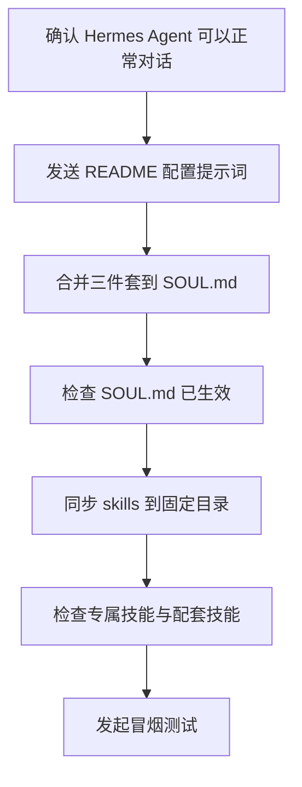

# Hermes Agent 产品管理智能体团队配置流程

基于单 **Agent** 架构：`[product-agent/](product-agent/)` 为唯一对外入口；业务流程先进入 6 个专属技能之一，再由专属技能 `SKILL.md` 委派配套技能，形成「需求输入 → 分析 → 管理 → 方案 → 评审」闭环。

## 快速开始（务必按顺序）

### 1）配置 Hermes Agent（第一步）

注意：以下操作会重置你的 Hermes Agent 智能体信息、性格、风格、经历等信息，请谨慎操作！！！

将下列提示词发给 Hermes：

```text
按照以下信息修改你的SOUL.md文件，修改后立即更新：

【更新配置】
- 如果当前已经存在智能体信息和 skills，则检查差异内容，更新智能体配置，更新专属技能和配套技能，以当前信息为主

【智能体基础信息】
- id: product-agent
- 中文显示名称: 产品管理智能体团队
- 仅保留该智能体作为对外入口

【三件套来源文件（仓库内）】
- product-agent/AGENTS.md
- product-agent/IDENTITY.md
- product-agent/SOUL.md

【项目仓库】
- https://github.com/AnatoleRise/Agents/tree/main/product-agent-Qclaw-Hermes
- 引导：可克隆本仓库或在 GitHub 在线浏览，以对照完整目录、skills 与最新文档，便于同步与校验配置。

【修改 SOUL.md 文件】
1) 读取上述三件套源文件内容，并将三者信息合并写入 `~/.hermes/SOUL.md`。
2) 修改完成后立即回传 `~/.hermes/SOUL.md` 的最终内容摘要，确认已生效。

【随后继续完成技能配置】
1) 将仓库 `skills/` 目录同步到 `~/.hermes/skills/`。
2) 校验 6 个专属技能目录齐全：
   customer-research
   product-exploration
   user-analysis
   requirement-management
   solution-design
   requirement-review
3) 校验配套技能目录齐全：
   search-engine
   competitor-research
   competitor-web-crawler
   report-generator
   difference-panel
   prd-document-generator
   business-diagram-generator
   interactive-prototype-generator
   logic-detector
   issue-tracker
   feishu-requirement-entry
   feishu-requirement-board
   feishu-requirement-archive
   app-market-sentiment
   core-metrics-analysis
   user-feedback-processor
   alert-early-warning
   data-visualization
4) 如仓库内不存在 skill，则不用配置相关技能，只配置已有技能

【检查结果报告】
完成上述配置后输出一份检查结果：
   - `~/.hermes/SOUL.md` 是否已包含三件套信息
   - `~/.hermes/skills/` 路径下专属技能与配套技能是否全部可见
   - 若有缺失，给出缺失目录名和修复动作
```

### 2）检查配置是否生效

- 检查智能体是否为「产品管理智能体团队」。
- 检查 `~/.hermes/SOUL.md` 是否已包含 `AGENTS.md`、`IDENTITY.md`、`SOUL.md` 三份源内容。
- 检查 `~/.hermes/skills/` 是否同时具备 6 个专属技能和 18 个配套技能。
- 发起一条冒烟测试：模糊需求先澄清；明确需求先进入专属技能，再委派配套技能。

### 3）测试用例

| 编号 | 测试场景 | 输入 | 预期行为 | 结果 |
|------|----------|------|----------|------|
| TC-01 | 模糊需求澄清 | 「我想做一个关于用户积分的功能」 | 先反问关键澄清项（目标用户、核心场景、业务目标、优先级） | ☐ |
| TC-02 | 明确需求→用户分析 | 「分析我们 App 最近 30 天的用户留存情况」 | 先进入 `user-analysis`，再按需委派 `data-visualization` / `core-metrics-analysis` | ☐ |
| TC-03 | 明确需求→需求管理 | 「我有一个新功能需求，请帮我整理成 PRD」 | 先进入 `requirement-management`，再委派 `prd-document-generator` | ☐ |
| TC-04 | 需求评审 | 「帮我评审一下这份 PRD 的逻辑完整性」 | 进入 `requirement-review`，再委派 `logic-detector` | ☐ |

### 配置流程图

