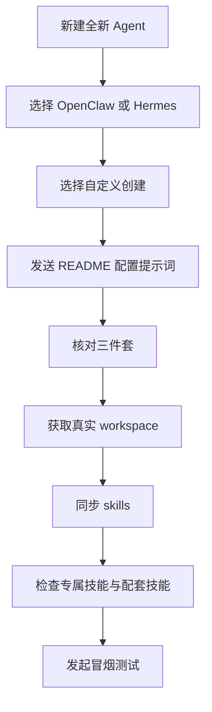

# Qclaw / OpenClaw 产品管理智能体团队：**product-agent** + 专属技能 委派

基于单 **Agent** 架构：`**[product-agent/](product-agent/)`** 为唯一对外入口；业务流程先进入 6 个专属技能之一，再由专属技能 `SKILL.md` 委派配套技能，形成「需求输入 → 分析 → 管理 → 方案 → 评审」闭环。

## 快速开始（务必按顺序）

### 1.1）在 Qclaw 中配置智能体（第一步）

1. 在 Qclaw 对话页点击「新建 Agent」，创建一个全新的 Agent，不复用旧 Agent。
2. 内核选择「OpenClaw 内核」或「Hermes Agent」均可，二选一。
3. 选择「自定义 - 创建全新 Agent」，不要选择预制智能体。
4. 点击「现在创作」按钮，将下列提示词完整替换后发送。
- **注意：以下操作会重置你的QClaw智能体信息、性格、风格、经历等信息，请创建一个全新的Agent操作，不要在主Agent（Qclaw）操作！！！**

### 1.2）OpenClaw不用上述配置，配置好openclaw可以正常对话后，直接将下列提示词发给 OpenClaw

- **注意：以下操作会重置你的openclaw智能体信息、性格、风格、经历等信息，请谨慎操作！！！**


将下列提示词发给 Qclaw：

```text
按照以下信息修改你的AGENTS.md、IDENTITY.md、SOUL.md文件，修改后立即更新：
【更新配置】
- 如果当前已经存在智能体信息和Skills，则检查差异内容，更新智能体配置，更新专属技能和配套技能，以当前信息为主

【智能体基础信息】
- id: product-agent
- 中文显示名称: 产品管理智能体团队
- 仅保留该智能体作为对外入口

【三件套来源文件（仓库内）】
- product-agent/AGENTS.md
- product-agent/IDENTITY.md
- product-agent/SOUL.md

【请在该智能体真实 workspace 根目录完成以下操作】
1) 用上述三件套内容覆盖 AGENTS.md、IDENTITY.md、SOUL.md（文件名保持大写）。
2) 修改完成后立即回传这三个文件的最终内容摘要，确认已生效。
3) 返回该智能体真实 workspace 的绝对路径（例如 /.../workspace-xxx）。

【随后继续完成技能配置】
1) 将仓库 skills/ 目录同步到 <真实 workspace>/skills/。
2) 校验 6 个专属技能目录齐全：
   customer-research
   product-exploration
   user-analysis
   requirement-management
   solution-design
   requirement-review
3) 校验配套技能目录齐全：
   search-engine
   competitor-research
   competitor-web-crawler
   report-generator
   difference-panel
   prd-document-generator
   business-diagram-generator
   interactive-prototype-generator
   logic-detector
   issue-tracker
   feishu-requirement-entry
   feishu-requirement-board
   feishu-requirement-archive
   app-market-sentiment
   core-metrics-analysis
   user-feedback-processor
   alert-early-warning
   data-visualization
4) 如仓库内不存在skill，则不用配置相关技能，只配置已有技能

【检查结果报告】
完成上述配置后输出一份检查结果：
   - AGENTS.md / IDENTITY.md / SOUL.md 是否与仓库源文件一致
   - 真实 workspace 路径
   - 专属技能与配套技能是否全部可见
   - 若有缺失，给出缺失目录名和修复动作
```

### 2）检查配置是否生效

- 检查智能体是否为「产品管理智能体团队」。
- 检查智能体是否已更新 `AGENTS.md` / `IDENTITY.md` / `SOUL.md`。
- 检查智能体是否是否同时具备 6 个专属技能和 18 个配套技能。
- 发起一条冒烟测试：模糊需求先澄清；明确需求先进入专属技能，再委派配套技能。

### 3）测试用例

| 编号 | 测试场景 | 输入 | 预期行为 | 结果 |
|------|----------|------|----------|------|
| TC-01 | 模糊需求澄清 | 「我想做一个关于用户积分的功能」 | 智能体应先反问澄清：目标用户、核心场景、业务目标、优先级等，而非直接出方案 | ☐ |
| TC-02 | 明确需求→用户分析 | 「分析我们 App 最近30天的用户留存情况」 | 先进入 `user-analysis` 专属技能，再按需委派 `data-visualization` / `core-metrics-analysis` 配套技能 | ☐ |
| TC-03 | 明确需求→竞品调研 | 「对比我们和竞品 X 的核心功能差异」 | 先进入 `competitor-research` 配套技能链路（由对应专属技能委派），输出对比报告 | ☐ |
| TC-04 | 明确需求→需求管理 | 「我有一个新功能需求，请帮我整理成 PRD」 | 先进入 `requirement-management` 专属技能，再委派 `prd-document-generator` 生成文档 | ☐ |
| TC-05 | 明确需求→方案设计 | 「帮我设计用户成长体系的产品方案」 | 先进入 `solution-design` 专属技能，再按需委派 `business-diagram-generator` / `interactive-prototype-generator` | ☐ |
| TC-06 | 需求评审 | 「帮我评审一下这份 PRD 的逻辑完整性」 | 进入 `requirement-review` 专属技能，委派 `logic-detector` 进行漏洞检测 | ☐ |
| TC-07 | 客户调研 | 「帮我做一份目标用户画像调研」 | 进入 `customer-research` 专属技能，委派 `search-engine` / `survey-generator` 等配套技能 | ☐ |
| TC-08 | 产品探索 | 「帮我探索这个方向的产品机会」 | 进入 `product-exploration` 专属技能，组合多个配套技能输出机会分析 | ☐ |
| TC-09 | 飞书需求同步 | 「从飞书同步一条需求到看板」 | 触发 `feishu-requirement-entry` → `feishu-requirement-board` 链路，验证飞书文档读取和看板写入 | ☐ |
| TC-10 | 异常处理 | 输入无意义内容（如「你好」「测试」） | 智能体应引导用户使用正确的需求输入格式，而非沉默或输出无关内容 | ☐ |

---

### 配置流程图


