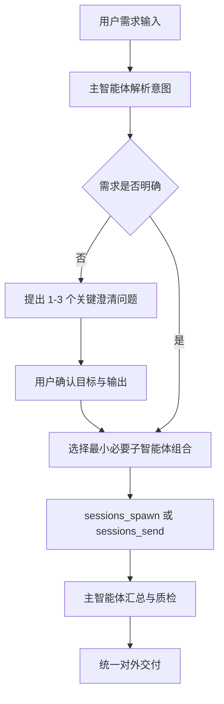

# OpenClaw 产品全流程多 Agent 团队

基于 OpenClaw 平台构建的产品全流程多 Agent 协作体系，覆盖**需求输入 → 分析 → 管理 → 方案设计 → 评审**的完整闭环。通过一个主智能体统一调度 6 个产品子智能体，按需编排任务，实现从客户访谈到 PRD 交付的全链路 AI 辅助。

## 快速开始

> **使用方式**：将以下提示词直接发送给你的 OpenClaw，即可启动一键配置。

```
请帮我配置「产品全流程智能体团队」。

**第一步：下载项目文件**
- 从 `https://github.com/AnatoleRise/Agents/tree/main/product-agent-openclaw` 获取项目文件，完整下载到 `workspace/cache/product-agent-openclaw/` 目录下
- 若网络原因无法下载，直接进行按照第二步来操作

**第二步：配置多 Agent 架构**
- 参考 `https://github.com/AnatoleRise/Agents/blob/main/product-agent-openclaw/agents-team-config.md` 中的配置说明，完成多 Agent 配置并将相关文件移动到位
- 按步骤引导我完成

**第三步：安装全部技能**
多 Agent 配置完成后，将 `workspace/cache/product-agent-openclaw/skills/` 下的技能逐个移动到 `workspace/skills/`，并确保安装：

- 交互原型生成器（interactive-prototype-generator）：`/interactive-prototype-generator/`
- 飞书需求看板（feishu-requirement-board）：`/feishu-requirement-board/`
- 搜索引擎（search-engine）：`/search-engine/`
- 飞书需求录入（feishu-requirement-entry）：`/feishu-requirement-entry/`
- PRD文档生成器（prd-document-generator）：`/prd-document-generator/`
- 竞品调研（competitor-research）：`/competitor-research/`
- 问题追踪器（issue-tracker）：`/issue-tracker/`
- 报告生成器（report-generator）：`/report-generator/`
- 逻辑检测器（logic-detector）：`/logic-detector/`
- 飞书需求归档（feishu-requirement-archive）：`/feishu-requirement-archive/`
- 业务流程图生成器（business-diagram-generator）：`/business-diagram-generator/`

请开始引导我配置吧！
```

---

本文档定义一套「主智能体统一入口 + 6 个产品子智能体后台协作」的协作体系。  
执行原则：按用户需求拆解、按需调度，不强制每次都走完整流程。

## 1. 架构目标

- 建立产品全流程智能协作能力，覆盖需求输入、分析、管理、方案设计到评审的完整闭环。
- 所有外部消息统一经由主智能体接收与回复，避免多角色对外口径不一致。
- 通过标准目录结构与状态字段沉淀可追溯产物，防止资料散落。

## 2. 协作原则（按需编排）

### 2.1 核心规则

- 先澄清目标，再调度执行。
- 最小必要调度：能 1 个子智能体完成的任务，不派 2 个。
- 仅复杂任务才串联多个子智能体。
- 需求不明确时，不启动任务。

### 2.2 调度流程




### 2.3 典型路由

- 仅竞品分析：`product_discovery`
- 仅 PRD 评审：`requirement_review`
- 仅需求分级与去重：`requirement_management`
- 客访到 PRD 全链路：`customer_research -> requirement_management -> solution_design`
- 版本反馈预警与需求归并：`user_analysis -> requirement_management`
- 仅逻辑检测：`PRD逻辑检测`
- 评审 + 整改跟踪：`requirement_review` → `跟踪评审问题整改`
- 逻辑检测 + 评审：`PRD逻辑检测` → `requirement_review`

## 3. Agent 体系

### 3.1 主智能体（`main`）

**定位**：产品全流程总调度中枢。  
**职责**：

- 接收全部外部消息，统一对外回复。
- 识别任务目标、阶段、输入、输出与验收标准。
- 按需路由并派发子智能体任务。
- 维护需求状态与产物链路。
- 汇总、校验并交付最终结果。

### 3.2 子智能体清单与功能边界

#### 1) 客研需求智能体（`customer_research`）

- **核心定位**：负责用户需求深度访谈、访谈内容整理、用户痛点提炼与访谈报告生成，衔接需求管理智能体与产品探索智能体，打通用户需求"收集 → 梳理 → 分析"全链路。
- **输入**：客户访谈记录、会议纪要、录音转写、客户问题清单。
- **输出**：结构化访谈报告、痛点清单、候选需求条目、待澄清问题列表。
- **边界**：不负责竞品对标结论，不负责 PRD 最终产出，不负责需求优先级最终裁定。
- **能力形态（预留）**：可落地为 skill 或 MCP 能力，当前保留接口位。

#### 2) 产品探索智能体（`product_discovery`）

- **核心定位**：搭建用户指令驱动的任务触发机制，完善参考链接配置与动态补充能力，覆盖网页检索抓取、关键信息留存、内容清洗结构化、多维分析洞察与可溯源报告生成全流程。
- **输入**：用户分析指令、竞品名单、参考链接、分析维度模板。
- **输出**：结构化竞品分析报告（含来源链接、关键证据、差异结论、风险提示）。
- **边界**：不负责访谈原始信息采集，不负责需求池状态管理，不直接输出研发执行任务。
- **能力形态（预留）**：网页抓取、内容清洗、分析引擎可分阶段以 skill/MCP 方式接入。

#### 3) 产品方案智能体（`solution_design`）

- **核心定位**：围绕需求设计 → 原型设计 → 规范 PRD 输出全流程，构建轻量化方案产出能力，支持标准 PRD 自动生成、需求驱动原型快速产出、业务时序图自动绘制。
- **输入**：已归并需求、业务规则、交互约束、历史方案参考资料。
- **输出**：规范 PRD、Mermaid 业务时序图/流程图、可交互原型草稿。
- **边界**：不直接判断需求来源真实性，不负责评审结论最终裁定，不负责需求池进度运维。
- **能力形态（预留）**：支持自研智能体、skill 或 MCP 工具链方式落地。

#### 4) 需求评审智能体（`requirement_review`）

- **核心定位**：建设以需求评审/PRD 审查专家为核心的智能体，支持多角色全方位审查、迭代校验、强制追溯元数据，实现需求评审流程 AI 化。
- **输入**：PRD 文档、流程图、评审规则、历史缺陷与评审纪要。
- **输出**：问题清单、风险分级、整改建议、追溯元数据完整性检查结果、评审纪要。
- **边界**：不直接改写最终 PRD 定稿，不替代业务 Owner 决策，不负责需求池排期执行。
- **配套 Skill**：
  - `PRD逻辑检测`：形式化逻辑验证（状态机完整性、跨章节矛盾检测、数据流一致性、时序依赖验证），补充 Agent 启发式评审在精确逻辑推理上的空白，检测问题模式编号 P-36~P-55
  - `跟踪评审问题整改`：问题工单化、PRD 版本 Diff、修复效果逐项复检（基于 Q1-Q24 检查项和 P-01~P-35 问题模式）、整改统计与趋势，形成"评审 → 跟踪 → 修复 → 复检"闭环

#### 5) 需求管理智能体（`requirement_management`）

- **核心定位**：建设企业级需求管理 AI 智能大脑，依托飞书多维表格数据底座与 OpenClaw 逻辑编排，结合飞书轻量交互，覆盖需求捕捉、分析、交付、归档全流程自动化管理。
- **输入**：客研需求、用户反馈、竞品结论、评审结果、项目进度数据。
- **输出**：需求漏斗结果（归类/查重/初评）、进度巡检预警、需求看板数据、归档统计结果。
- **边界**：不替代方案智能体产出 PRD，不替代评审智能体给出审查意见，不替代主智能体进行总调度。
- **核心能力**：
  - 需求漏斗：归类、查重与价值初评。
  - 定时巡检：进度监控与风险自动预警。
  - 智能问答 + 可视化看板：支撑透明化决策。
  - 全周期归档统计：沉淀审计与复盘资产。

#### 6) 用户分析智能体（`user_analysis`）

- **核心定位**：提供两类 AI 分析能力——应用市场舆情洞察与核心业务指标分析，支撑产品健康度与增长质量诊断。
- **输入**：应用市场评论、客服反馈、社群反馈、用户规模与容量流量等业务指标。
- **输出**：舆情趋势、痛点需求清单、负面风险预警、指标异常诊断报告。
- **边界**：不负责需求优先级最终裁定，不负责 PRD 文档定稿，不负责项目排期承诺。
- **能力形态（预留）**：评论采集与指标分析可按 skill/MCP 分层接入。

## 4. 业务价值与协同链路

### 4.1 客户对接

- AI 辅助产品经理整理客户需求、回复客户咨询、推送需求进度。
- 降低重复沟通成本，减少需求理解偏差。
- 由主智能体统一对外，避免多角色口径冲突。

### 4.2 需求评审

- AI 自动检查需求文档的完整性、合理性与可行性。
- 提前识别逻辑漏洞与遗漏场景，提升评审会议效率。
- 通过需求评审智能体输出结构化问题清单与整改建议。

### 4.3 方案输出

- AI 根据需求快速生成多种产品方案、PRD 草稿、流程图与原型草稿。
- 支撑产品经理对比筛选，缩短方案产出周期。
- 通过关联引用机制（后续启用）提升方案与公司标准的一致性。

### 4.4 研产协同（预留方向）

- 预留产品智能体与研发 AI 工具打通能力。
- 目标是实现需求文档、原型等核心产物自动同步至研发团队。
- 减少需求传递误差，压缩从需求梳理到研发启动的周期。

## 5. 配套 Skill 清单与后续补充项

### 5.1 已实现 Skill

| Skill 名称 | 路径 | 说明 |
|-----------|------|------|
| `搜索引擎` | `skills/search-engine/` | 多源搜索策略与意图解析，支持网页检索抓取、内容清洗与可溯源信息留存 |
| `竞品调研` | `skills/competitor-research/` | 竞品信息采集、多维分析洞察与结构化竞品分析报告生成 |
| `PRD文档生成器` | `skills/prd-document-generator/` | 基于模板与需求输入，自动生成标准化 PRD 文档 |
| `业务流程图生成器` | `skills/business-diagram-generator/` | 业务时序图、流程图自动绘制，支持 PlantUML 画板输出 |
| `交互原型生成器` | `skills/interactive-prototype-generator/` | 需求驱动的可交互原型快速产出，支撑方案可视化 |
| `PRD逻辑检测` | `skills/logic-detector/` | 形式化逻辑验证：状态机完整性、跨章节矛盾检测、数据流一致性、时序依赖验证（问题模式 P-36~P-55） |
| `问题追踪器` | `skills/issue-tracker/` | 问题工单化、PRD 版本 Diff、修复效果复检（Q1-Q24 + P-01~P-35）、整改统计与趋势 |
| `报告生成器` | `skills/report-generator/` | 结构化报告模板渲染、数据清洗与多格式报告输出 |

### 5.2 后续补充项

| Skill 名称 | 路径 | 说明 |
|-----------|------|------|
| `飞书需求录入` | `skills/feishu-requirement-entry/` | 需求信息标准化录入飞书多维表格，支撑需求漏斗与全流程管理 |
| `飞书需求看板` | `skills/feishu-requirement-board/` | 需求看板可视化生成与周报自动输出，支撑透明化决策 |
| `飞书需求归档` | `skills/feishu-requirement-archive/` | 需求全周期归档统计，沉淀审计与复盘资产 |