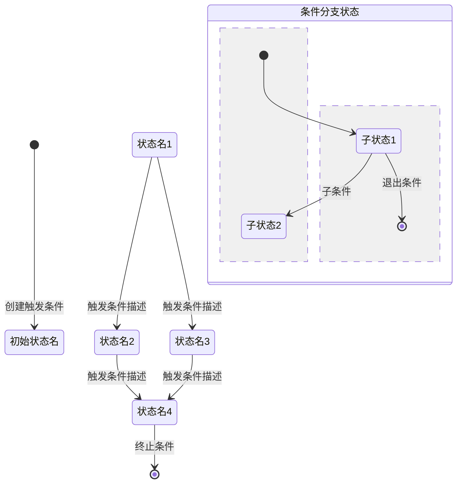
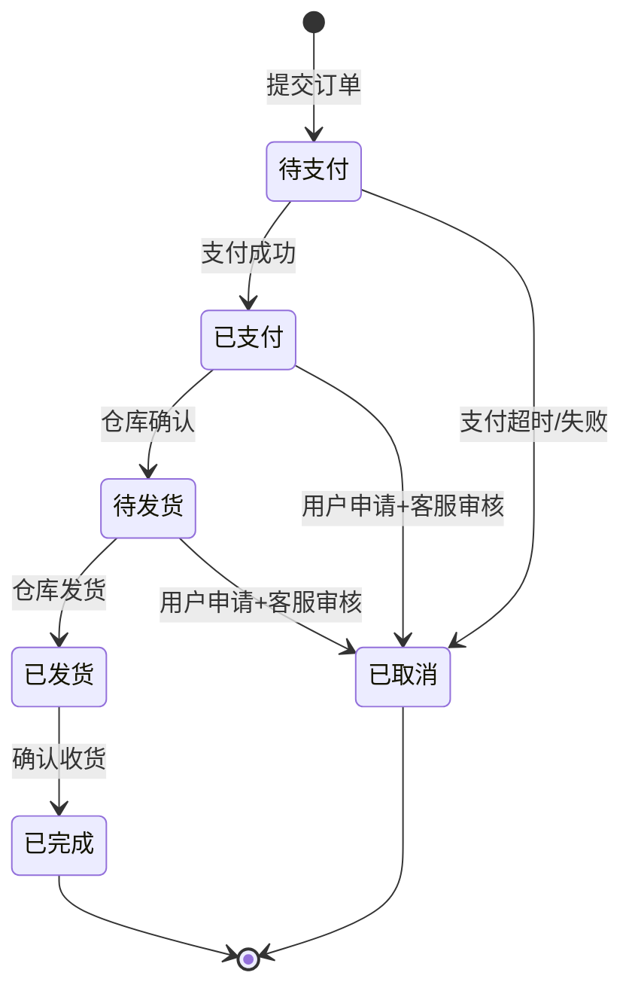

<!-- PRD 逻辑检测 Skill 参考文件 - 状态机验证模式库 -->

# 状态机验证模式库

> 本库收录 PRD 中状态定义的常见表达模式、状态机完整性检查清单、常见反模式和验证案例。

---

## 一、PRD 中状态定义的常见表达模式

### 模式 1：明确枚举

PRD 以列表形式直接给出所有状态。

**识别正则**：
```
(.+?)状态(?:包括|包含|分为|有)[：:]\s*([^。；;]+)
```

**示例**：
> "订单状态包括：待支付、已支付、已发货、已完成、已取消"

**提取方法**：
- 实体名：正则捕获组 1（"订单"）
- 状态列表：按逗号/顿号/分号分割捕获组 2，去空白

### 模式 2：状态转换描述

PRD 描述从一个状态到另一个状态的转换。

**识别正则**：
```
(?:当|如果|在)(.+?)(?:时|的情况下)[，,]\s*(.+?)(?:进入|变为|转为|切换至)(.+?)(?:状态)?
```

**示例**：
> "当用户付款成功时，订单进入已支付状态"

**提取方法**：
- 触发条件：捕获组 1（"用户付款成功"）
- 实体：捕获组 2（"订单"）
- 目标状态：捕获组 3（"已支付"）

### 模式 3：被动语态状态描述

**识别正则**：
```
(.+?)被(?:标记为|设置为|更新为|改为)(.+?)(?:状态)?
```

**示例**：
> "订单被标记为已取消状态"

**提取方法**：
- 实体：捕获组 1（"订单"）
- 目标状态：捕获组 2（"已取消"）

### 模式 4：条件触发 + 状态变更

**识别正则**：
```
(.+?)后[，,]\s*(?:系统|自动)?(?:将)?(.+?)(?:标记为|设置为|更新为|改为)(.+?)
```

**示例**：
> "支付超时后，系统自动将订单标记为已取消"

**提取方法**：
- 触发条件：捕获组 1（"支付超时"）
- 实体：捕获组 2（"订单"）
- 目标状态：捕获组 3（"已取消"）

### 模式 5：表格/列表形式的状态定义

**识别模式**：
- Markdown 表格中包含列名如"状态"、"状态名称"、"状态码"、"status"
- 表格行中每个状态后有对应的触发条件或转换目标

**提取方法**：
- 解析 Markdown 表格，提取状态名列的所有值
- 检查同一表格或相邻表格是否有"前置状态"、"目标状态"、"触发条件"等列

### 模式 6：流程图描述

PRD 以文字形式描述流程图，包含分支和状态节点。

**识别关键词**：
- "进入"、"流转到"、"回到"、"跳转至"、"返回"
- "分支"、"条件判断"、"通过/不通过"
- "开始于"、"结束于"、"终止"

**提取方法**：
- 将文字流程描述转换为节点和边的列表
- 每个"进入"、"流转到"等动词标记一次状态转换
- 分支条件提取为触发条件

### 模式 7：生命周期描述

PRD 以"生命周期"或"流程"为标题描述实体的完整生命周期。

**识别关键词**：
- "生命周期"、"完整流程"、"业务流程"、"流转过程"
- "从...到..."、"自...至..."

**提取方法**：
- 按时间顺序排列所有涉及的状态
- 标注每个状态转换的触发条件
- 缺失的转换（即两个连续状态之间的跳转）标记为"隐含转换"

### 模式 8：审批/工单流状态

**识别关键词**：
- "审批"、"审核"、"复核"、"会签"
- "通过"、"驳回"、"拒绝"、"撤回"
- "提交"、"待审"、"审批中"、"已审批"

**提取方法**：
- 审批流通常是双状态结构（源状态 → 审批决策状态），特别注意"驳回"后的目标状态
- 审批流常见的缺失项：驳回到哪个状态？（提交人？上一级？初始状态？）

### 模式 9：隐含状态定义

PRD 没有明确列出状态，但在流程描述中隐含了状态的存在。

**识别方法**：
- 当流程描述中出现"如果...则...否则..."分支时，不同分支意味着不同的状态
- 当描述中说"可以进行 X 操作"和"可以进行 Y 操作"互斥时，意味着存在两个互斥状态

**示例**：
> "已支付的订单可以申请退款，未支付的订单可以直接取消"

此描述隐含了"已支付"和"未支付"两个状态，且各自有不同的允许操作。

### 模式 10：状态与操作互斥

PRD 中描述了某个操作只能在特定状态下执行。

**识别正则**：
```
(?:只有|仅|仅当)(.+?)(?:状态(?:下)?)?(?:才)?(?:可以|能|允许)(.+?)
```

**示例**：
> "只有已支付状态的订单才能申请退款"

**提取方法**：
- 此描述定义了状态"已支付"到操作"申请退款"的权限关系
- 反向推导：哪些状态不允许此操作？这些状态是否存在？是否有明确的转换路径？

---

## 二、状态机完整性检查清单

对每个提取出的状态机，逐一检查以下项目：

### 2.1 状态定义完整性

- [ ] **SM-CHK-01**：所有状态是否都有明确的定义？（不能只有状态名而没有说明）
- [ ] **SM-CHK-02**：PRD 中引用的状态是否都在状态枚举中出现？（不能有"幽灵状态"）
- [ ] **SM-CHK-03**：初始状态是否明确定义？
- [ ] **SM-CHK-04**：终止状态（终态）是否明确定义？（哪些状态是实体生命周期的终点）
- [ ] **SM-CHK-05**：状态数量是否合理？（一个实体超过 15 个状态通常意味着状态粒度太细或存在隐性子状态机）

### 2.2 状态转换完整性

- [ ] **SM-CHK-06**：每个非终止状态是否都定义了至少一条出边？（无出边的非终止态 = 死锁）
- [ ] **SM-CHK-07**：每个非初始状态是否都定义了至少一条入边？（无入边的非初始态 = 不可达）
- [ ] **SM-CHK-08**：所有核心业务流程涉及的状态转换是否都在图中存在对应边？
- [ ] **SM-CHK-09**：是否存在"跳级转换"（如待支付→已完成，跳过了已支付+已发货）？如果存在，是否与业务规则冲突？
- [ ] **SM-CHK-10**：审批/驳回等回退操作的目标状态是否明确定义？

### 2.3 触发条件完整性

- [ ] **SM-CHK-11**：每条转换边的触发条件是否明确定义？（不能有"自动"这种模糊条件）
- [ ] **SM-CHK-12**：是否存在同一源状态 + 同一触发条件但指向不同目标状态的边？
- [ ] **SM-CHK-13**：是否存在触发条件重叠的情况？（如"超时"和"30分钟未支付"实际是同一条件）
- [ ] **SM-CHK-14**：触发条件是否覆盖了所有可能的业务场景？（包括超时、失败、取消等异常触发）

### 2.4 可测试性

- [ ] **SM-CHK-15**：每个状态转换是否可以编写 Given-When-Then 测试用例？
- [ ] **SM-CHK-16**：状态转换是否有明确的"不可逆"标记？（哪些转换是单向的、不可回退的）
- [ ] **SM-CHK-17**：并发状态转换是否有冲突策略？（多个触发条件同时满足时，优先级如何？）

---

## 三、常见状态机反模式

### 反模式 1：死锁状态（Deadlock State）

**定义**：一个非终止状态没有任何出边（无可触发转换），导致实体一旦进入此状态就无法离开。

**检测方法**：
```
对每个状态 s ∈ S：
  如果 s 不是终止状态 AND 出度(s) == 0：
    标记为死锁状态
```

**PRD 示例**：
> "订单状态：待支付、支付中、已支付、已发货、已完成、退款中"

如果"支付中"状态没有任何出边（既没有"支付成功→已支付"，也没有"支付失败→待支付"），则为死锁状态。

**对应问题模式**：P-37

### 反模式 2：不可达状态（Unreachable State）

**定义**：从初始状态出发，无法通过任何转换路径到达的状态。

**检测方法**：
```
从初始状态执行 BFS/DFS：
  已访问集合 visited = {初始状态}
  队列 queue = [初始状态]
  while queue 非空：
    current = queue.pop()
    for each (current, target, trigger) in 转换集合：
      if target not in visited：
        visited.add(target)
        queue.push(target)
  未访问状态 = 所有状态 - visited
```

**PRD 示例**：
> "订单状态：待支付、已支付、已发货、已完成、已取消"
> 状态转换：待支付→已支付, 已支付→已发货, 已发货→已完成

"已取消"状态没有任何入边，为不可达状态。

**对应问题模式**：P-36

### 反模式 3：矛盾转换（Contradictory Transition）

**定义**：同一源状态下，同一触发条件导致两个不同的目标状态。

**检测方法**：
```
对转换集合 T 中的每对 (s1, t1, trig1) 和 (s2, t2, trig2)：
  如果 s1 == s2 AND trig1 在语义上等价于 trig2 AND t1 != t2：
    标记为矛盾转换
```

语义等价判定规则：
- 两个触发条件的字符串相似度 > 0.8 且关键动词/名词完全一致
- 或者两个触发条件可以从 PRD 上下文中推断为同一个条件的不同表述

**PRD 示例**：
- 第 2 章："支付成功后订单状态变为已支付"
- 第 5 章："支付成功后订单状态变为待发货"

**对应问题模式**：P-39

### 反模式 4：缺失回退路径（Missing Rollback Path）

**定义**：存在正向转换但缺少业务合理的逆向转换。

**检测方法**：
```
对每条转换 (s1, s2, trig)：
  如果不存在转换 (s2, s1, *) 且以下条件之一为真：
    - s1 和 s2 都是非终止状态
    - s2 是异常/中间状态且业务应支持回退
    - PRD 中其他章节暗示了回退的必要性（如"支持撤销"）
  标记为缺失回退路径
```

**PRD 示例**：
> "用户提交订单后进入待支付状态，支付成功后进入已支付状态"

如果 PRD 中同时提到"用户可以在支付前取消订单"，但状态图中没有"待支付→已取消"的边，则为缺失回退路径。

**对应问题模式**：P-40

### 反模式 5：竞态条件（Race Condition）

**定义**：多个触发条件可能同时满足，且 PRD 未定义优先级或冲突处理。

**检测方法**：
```
对每个状态 s：
  如果 s 的出边触发条件集合中存在一组条件 C = {c1, c2, ...}：
    如果 c1, c2, ... 可能在现实世界中同时发生 且 PRD 未定义优先级：
      标记为潜在竞态条件
```

**PRD 示例**：
> "用户提交订单后，支付超时自动取消；用户也可手动取消订单"

如果"支付超时自动取消"和"手动取消"可能同时发生（用户在超时瞬间点击取消），且 PRD 未定义冲突策略，则为竞态条件。

---

## 四、状态机可视化模板

### 4.1 Mermaid stateDiagram 模板



### 4.2 状态机验证报告可视化标注

在生成的状态机图中，使用以下标记：

| 标记 | 含义 | 图例 |
|------|------|------|
| ⚠️ 红色节点 | 不可达状态或死锁状态 | `style 状态名 fill:#f8d7da,stroke:#721c24` |
| ⚠️ 红色虚线边 | 矛盾转换 | `状态A -.-→ 状态B : ⚠️矛盾` |
| ⚠️ 橙色虚线边 | 缺失转换路径 | `状态A -.-→ 状态B : ⚠️缺失` |
| ⚠️ 黄色虚线边 | 未定义回退路径 | `状态A -.-→ 状态B : ⚠️无回退` |
| ✅ 绿色节点 | 正确的终止状态 | `style 状态名 fill:#d4edda,stroke:#155724` |
| 🔵 蓝色节点 | 初始状态 | `style 状态名 fill:#cce5ff,stroke:#004085` |

### 4.3 可视化生成代码模板

```javascript
// 在生成 Mermaid 代码时，附加以下样式声明：
const issueStyles = issues.map(issue => {
  switch(issue.type) {
    case 'unreachable':
      return `style ${issue.stateName} fill:#f8d7da,stroke:#721c24`;
    case 'deadlock':
      return `style ${issue.stateName} fill:#f8d7da,stroke:#721c24,stroke-dasharray:5`;
    case 'missing_backward':
      return `${issue.from} --> ${issue.to} : ⚠️ 缺失回退路径`;
    default:
      return '';
  }
}).join('\n');
```

---

## 五、状态机验证案例

### 案例 1：电商订单状态机（典型完整案例）

**PRD 原文**：
> 订单状态包括：待支付、已支付、待发货、已发货、已完成、已取消。
> 用户提交订单后进入待支付状态。
> 支付成功后进入已支付状态；支付失败或超时（30 分钟）后订单自动取消。
> 已支付订单经仓库确认后进入待发货状态。
> 仓库发货后进入已发货状态。
> 用户确认收货后进入已完成状态。
> 已支付和待发货状态的订单可由用户申请取消，经客服审核后进入已取消状态。

**状态机分析**：

状态集合 S = {待支付, 已支付, 待发货, 已发货, 已完成, 已取消}
转换集合 T = {
  (初始, 待支付, "提交订单"),
  (待支付, 已支付, "支付成功"),
  (待支付, 已取消, "支付超时/支付失败"),
  (已支付, 待发货, "仓库确认"),
  (待发货, 已发货, "仓库发货"),
  (已发货, 已完成, "确认收货"),
  (已支付, 已取消, "用户申请取消+客服审核"),
  (待发货, 已取消, "用户申请取消+客服审核")
}

**验证结果**：
- ✅ 所有状态可达（从初始状态 BFS 可达所有状态）
- ✅ 无死锁状态（非终止态均有出边，终止态为"已完成"和"已取消"）
- ✅ 无矛盾转换
- ✅ 所有核心业务流程转换路径完整
- 🟡 待支付→已取消路径中的"支付失败"和"支付超时"条件有重叠——建议明确区分

**Mermaid 代码**：


---

### 案例 2：审批工单状态机（缺失回退路径）

**PRD 原文**：
> 工单状态：待提交、待审批、审批中、已通过、已驳回。
> 员工创建工单后进入待提交状态，提交后进入待审批状态。
> 上级审批时工单进入审批中状态。
> 审批通过进入已通过状态。
> 审批驳回进入已驳回状态。

**状态机分析**：

状态集合 S = {待提交, 待审批, 审批中, 已通过, 已驳回}
转换集合 T = {
  (初始, 待提交, "创建工单"),
  (待提交, 待审批, "提交工单"),
  (待审批, 审批中, "上级开始审批"),
  (审批中, 已通过, "审批通过"),
  (审批中, 已驳回, "审批驳回")
}

**验证结果**：
- ❌ 🔴致命 — **不可达状态**：待审批→审批中转换中，待审批有入边和出边，但：待审批状态的入边仅从"待提交"来，可达。审批中状态的出边到达"已通过"和"已驳回"。已驳回状态出度为 0，是终止态。**但是，没有从"已驳回"回退到任何状态的路径！**员工修改工单后重新提交的流程完全缺失。
- ❌ 🔴致命 — **缺失转换路径**：缺少"已驳回→待提交（修改后重新提交）"或"已驳回→待审批（员工申诉）"的路径。
- 🟡 警告 — **死锁状态**：审批中如果审批人搁置，没有超时自动处理的定义。

**修改建议**：
1. 补充"已驳回→待提交"转换：员工修改后重新提交
2. 补充"已驳回→待审批"转换：员工申诉直接重新审批
3. 补充"审批中超时"处理：超时自动提醒或自动驳回

---

### 案例 3：用户账户状态机（不可达状态）

**PRD 原文**：
> 用户账户状态包括：正常、冻结、注销。
> 新用户注册后账户为正常状态。
> 违规用户被管理员冻结。
> 用户可主动申请注销。

**状态机分析**：

状态集合 S = {正常, 冻结, 注销}
从 PRD 中提取的转换：
- 初始 → 正常（注册）
- 正常 → 冻结（管理员冻结）
- 正常 → 注销（用户申请注销）

另有隐含状态变化（从业务常识推断）：
- 冻结后应该能解冻（但 PRD 未提及）

**验证结果**：
- ❌ 🔴致命 — **死锁状态**："冻结"状态出度为 0，且不是终止态（用户可能被解冻），一旦账户被冻结就无法恢复。
- 🟡 警告 — **不可达状态**："注销"状态从"正常"可达，无问题。但如果隐含存在"冻结→注销"的路径，则未定义。
- 🟡 警告 — **缺失回退路径**："冻结→正常"的解冻操作未定义。

**修改建议**：
1. 补充"冻结→正常"转换：管理员解冻
2. 明确冻结状态下的允许操作（是否可以申请注销？是否可以查看？）

---

### 案例 4：退款状态机（矛盾转换）

**PRD 原文**：
> 第 3 章："用户发起退款申请后，系统自动审核通过则退款状态变为退款中"
> 第 6 章："用户发起退款后，系统审核通过退款状态变为待退款"

**状态机分析**：

两个章节对同一触发条件"系统审核通过"给出了两个不同的目标状态：
- 第 3 章：退款中
- 第 6 章：待退款

**验证结果**：
- ❌ 🔴致命 — **矛盾转换**：同一源状态 + 同一触发条件 → 两个不同目标状态（"退款中"和"待退款"可能是同一个状态的不同叫法，也可能确实是两个不同状态）
- 如果"退款中"和"待退款"是同一状态，则属于术语不统一（Agent 覆盖）
- 如果"退款中"和"待退款"是两个不同状态，则存在逻辑矛盾（Skill 覆盖）

**处理建议**：
1. 先判定"退款中"和"待退款"是否为同一状态 → 如果是，归为术语不统一（Agent 问题）
2. 如果是两个不同状态 → 确认为矛盾转换，需要 PM 确认正确的目标状态

---

### 案例 5：物流配送状态机（跳级转换分析）

**PRD 原文**：
> 订单状态转换流程：待发货 → 已揽件 → 运输中 → 派送中 → 已签收。
> 特殊情况下（如用户自提），订单可从待发货直接变为已签收。

**状态机分析**：

正常路径：待发货 → 已揽件 → 运输中 → 派送中 → 已签收
跳级路径：待发货 ⟶ 已签收（用户自提）

**验证结果**：
- 🟡 警告 — **跳级转换**：待发货→已签收 跳过了 已揽件、运输中、派送中 三个状态
- 但 PRD 已明确说明了跳级的触发条件（用户自提），跳级转换本身是合理的
- 🟡 警告 — **需确认**：已揽件→运输中→派送中 的触发条件是否明确定义？PRD 未详细说明进入这些中间状态的条件
- 🟡 警告 — **需确认**：已签收后，退款/退货流程从哪个状态回退？PRD 未说明

**结论**：跳级转换有合理的业务场景支撑，不是逻辑缺陷。但中间状态的触发条件模糊和售后回退路径缺失需要补充。

---

## 六、状态机验证算法伪代码

```python
class StateMachineValidator:
    """
    状态机验证器 —— 从 PRD 文本中提取状态定义、构建状态图并进行完整性检查。
    """

    def extract_states(self, prd_text: str) -> list[str]:
        """从 PRD 文本中提取实体状态列表"""
        # 1. 匹配模式1：明确枚举
        pattern_enum = r'(.+?)状态(?:包括|包含|分为|有)[：:]\s*([^。；;]+)'
        # 2. 匹配模式2：状态转换描述中的目标状态
        pattern_transition = r'(?:进入|变为|转为|切换至)(.+?)(?:状态)?'
        # 3. 收集所有匹配结果并去重
        pass

    def extract_transitions(self, prd_text: str) -> list[tuple]:
        """从 PRD 文本中提取状态转换三元组 (源状态, 目标状态, 触发条件)"""
        patterns = [
            (r'当(.+?)时[，,]?\s*(.+?)(?:从)(.+?)(?:进入|变为)(.+?)(?:状态)?', 'pattern_a'),
            (r'(.+?)(?:后|成功|失败)[，,]?\s*(.+?)(?:进入|变为|标记为)(.+?)(?:状态)?', 'pattern_b'),
            # ... 更多模式
        ]
        pass

    def build_graph(self, states, transitions) -> dict:
        """构建有向图：{state: [target_states]}"""
        pass

    def check_reachability(self, graph, initial_state) -> list[str]:
        """BFS 检查可达性，返回不可达状态列表"""
        visited = set()
        queue = [initial_state]
        while queue:
            current = queue.pop(0)
            if current in visited:
                continue
            visited.add(current)
            for target in graph.get(current, []):
                if target not in visited:
                    queue.append(target)
        return [s for s in graph.keys() if s not in visited]

    def check_deadlock(self, graph, terminal_states) -> list[str]:
        """检查死锁状态：非终止态且出度为 0"""
        deadlocks = []
        for state, targets in graph.items():
            if len(targets) == 0 and state not in terminal_states:
                deadlocks.append(state)
        return deadlocks

    def check_contradictory_transitions(self, transitions) -> list[dict]:
        """检查矛盾转换：同源状态+同条件→不同目标"""
        from collections import defaultdict
        trigger_map = defaultdict(list)
        for src, tgt, trigger in transitions:
            key = (src, self.normalize_trigger(trigger))
            trigger_map[key].append(tgt)
        contradictions = []
        for (src, trigger), targets in trigger_map.items():
            if len(set(targets)) > 1:
                contradictions.append({
                    'source': src,
                    'trigger': trigger,
                    'targets': list(set(targets))
                })
        return contradictions

    def check_missing_rollback(self, transitions, graph) -> list[dict]:
        """检查缺失的回退路径"""
        missing = []
        for src, tgt, trigger in transitions:
            # 检查是否存在反向边
            has_reverse = any(t_src == tgt and t_tgt == src for t_src, t_tgt, _ in transitions)
            if not has_reverse:
                # 判断是否需要回退：源状态是中间状态，目标状态是非终止态
                if self.needs_rollback(src, tgt):
                    missing.append({'from': tgt, 'to': src, 'original': (src, tgt, trigger)})
        return missing

    def normalize_trigger(self, trigger: str) -> str:
        """规范化触发条件描述，用于语义等价比较"""
        # 去除修饰词（"自动"、"系统"、"将"等）
        # 统一动词时态（"完成后" → "完成"）
        stopwords = ['自动', '系统', '将', '会', '则']
        for sw in stopwords:
            trigger = trigger.replace(sw, '')
        return trigger.strip()

    def needs_rollback(self, src, tgt) -> bool:
        """判断一个转换是否需要定义回退路径"""
        # 业务规则：如果目标状态是可逆的中间状态，则需要回退
        # 终止状态（完成、取消、归档等）不需要回退
        terminal_keywords = ['完成', '已完结', '已取消', '已关闭', '已归档', '已删除']
        if any(kw in tgt for kw in terminal_keywords):
            return False
        if any(kw in tgt for kw in terminal_keywords):
            return False
        return True
```

---

## 七、状态机验证结果输出格式

```markdown
## 状态机验证结果

### 实体：[实体名称]

**状态集合**：[S1, S2, S3, ...]
**初始状态**：[S1]
**终止状态**：[Sx, Sy]
**转换数量**：[N]

### 状态转换图

\```mermaid
stateDiagram-v2
    [*] --> S1 : 触发条件
    S1 --> S2 : 触发条件
    ...
\```

### 检测结果

| 检测项 | 判定 | 详情 | 严重度 |
|--------|------|------|--------|
| SM-CHK-01 状态定义 | ✅/❌ | [详情] | - |
| SM-CHK-06 出边完整性 | ✅/❌ | [详情] | 🔴/🟡 |
| SM-CHK-07 入边完整性 | ✅/❌ | [详情] | 🔴/🟡 |
| ... | ... | ... | ... |

### 异常清单

#### 🔴 致命问题

**问题 1**：[P-36] 不可达状态
- 原文定位：[章节/段落]
- 不可达状态：[状态名]
- 分析：[为什么不可达]
- 建议：[如何修复]

...
```
